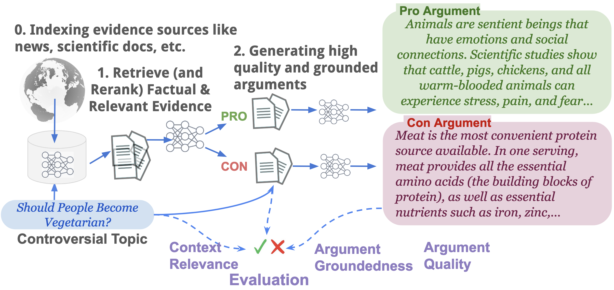

# ConQRet-RAG




Retrieval Augmented Argumentation or Retrieval Augmented Argument Generation involves retrieving noisy evidence documents over the web and using them for subsequent argument generation. To facilitate RAG and computational argumentation research, we release **ConQRet**, a benchmark with popular controversial queries, paired with evidence documents retrieved and scraped over the public web, alongwith model-generated arguments. 

## Applications
- Retrieval Augmented Generation
- Evaluating Standalone Retrieval
- Evaluating RAG systems

## Statistics of ConQRet
| Statistic                      |     |
|---------------------------------|-----|
| Total topics                    | 98  |
| Avg. docs per topic             | 133 |
| Avg. relevant docs per topic    | 66  |
| Avg. docs per stance            | 33  |

The total number of documents retrieved and scraped from the web are 6500.

## Getting Started

```ssh
python setup.py
```


Download the data from this [Google Drive link](https://drive.google.com/file/d/1jzNKVsc9VRc6kTOWFYdvp6NDoT4NQqak/view?usp=sharing), unzip it and copy it in the project home folder ("conqret-rag"). The password is provided at the end of the README. 
### Reproducing the Retrieval Results
This will run BM25 and BM25+GPT4o-mini reranker
```bash
python retriever.py
```
If you face a dlopen error, ensure that you set java home variables something like 
```python
import os
os.environ['JAVA_HOME'] = "...miniconda3/envs/conqret-rag/lib/jvm" 
os.environ['JVM_PATH'] = "...miniconda3/envs/conqret-rag/lib/jvm/lib/server/libjvm.dylib"
```

### Extracting the ProCon Arguments
Run the following script. It scrapes all the URLs present in the [url_list.txt](data/url_list.txt) file.
```bash
python procon-parser.py
```

### Password for Unzipping the Documents
SaglyanchaVichaarVasudhaivaKutumbakam01293872

Do not publicly upload elsewhere. We are sharing the documents separately to mitigate the possibility of it being used for training, although we do not guarantee that many of them might already be used by popular models through other means.

### Citation
```bibtex
@misc{dhole2024llmjudge,
  author    = {Kaustubh Dhole and Kai Shu and Eugene Agichtein},
  title     = {ConQRet: A New Benchmark for Fine-Grained Automatic Evaluation of Retrieval Augmented Computational Argumentation},
  year      = {2024},
  month     = {November},
  url       = {https://github.com/emory-irlab/conqret-rag/}
}
```